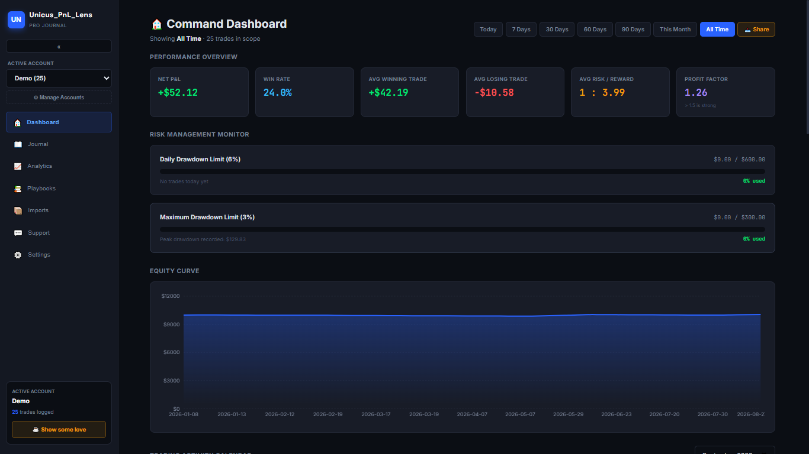
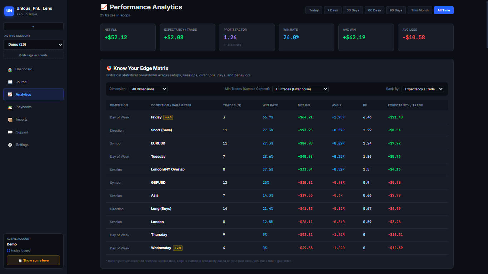

# My_PnL_Lens 📈

A free, local-first trading journal for forex traders. Import your MT5 history, analyze your edge, manage risk, and share your wins — no account, no tracking, no fees.


> **Live Demo:** [https://mypnllens.vercel.app/]

## 📸 Screenshots


*Command dashboard — equity curve, risk monitors & performance stats*


*Deep analytics — sessions, R-multiples, emotions & edge matrix*


## ✨ Features

**📖 Journaling**
- Multi-account support — each account has its own trades + settings
- MT5 CSV import with smart header detection (comma, tab & semicolon files)
- Manual trade logging, playbook tagging, emotions & notes per trade
- Full-text search + filters (symbol, playbook, outcome)

**📊 Analytics**
- Equity curve, win rate, profit factor, expectancy, R-multiples
- Session breakdown (Asia / London / NY) with broker timezone conversion
- Emotion performance analysis — which mindsets make vs lose money
- Rule adherence — perfect-execution trades vs broken-rule trades
- Know-Your-Edge matrix across 7 dimensions (setup, session, direction, day, symbol, emotion, rules)
- Period comparison & trading activity calendar

**🛡️ Risk Management**
- Daily drawdown guardrail with 🛑 breach alerts
- Maximum drawdown monitor with usage bars
- Set any limit to `0%` to hide its card

**📤 Sharing**
- One-click shareable PnL image (PNG) with period selector
- Privacy mode — share percentages instead of $ amounts

**🔒 Privacy**
- 100% local-first — data lives in your browser, nothing is uploaded
- One-click JSON backup, CSV export, wipe-anything controls

---

## 🚀 Getting Started

**Prerequisites:** [Node.js](https://nodejs.org/) 18+

```bash
# Clone the repo
git clone https://github.com/Iam-Paz/My_PnL_Lens.git
cd My_PnL_Lens

# Install dependencies
npm install

# Start developing (hot reload)
npm run dev

# Production build
npm run build